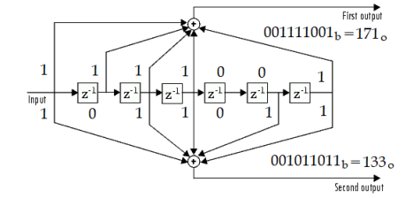

## Simulating an digital communication system com Convolucional Coding [133, 171]

#### This simulation is on baseband with 16-QAM modulation in Rayleigh SISO channel, with convolucional coding [133, 171] of rate R_c = 1/2 and restriction size equal 7

